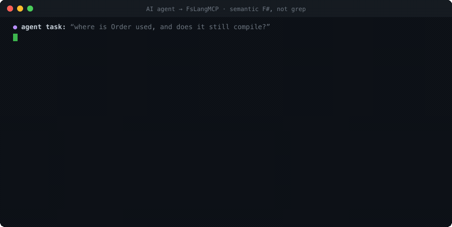

# FsLangMCP — semantic F# for your AI coding agent

**Stop your agent grepping F#.** Give it the real compiler: cross-project `find`, a trustworthy `check` verdict, types, rename, dead-code — over MCP.

[](https://github.com/Neftedollar/FsLangMCP/actions/workflows/ci.yml)
[](https://www.nuget.org/packages/FsLangMcp/)
[](https://www.nuget.org/packages/FsLangMcp/)
[](https://dotnet.microsoft.com/)
[](LICENSE)

[Documentation](https://neftedollar.com/FsLangMCP/) · [Getting started](https://neftedollar.com/FsLangMCP/guide/getting-started/) · [Tools reference](https://neftedollar.com/FsLangMCP/tools/reference/)

<p align="center">
  
</p>
<p align="center"><sub>An agent working a real task against <a href="examples/quickstart"><code>examples/quickstart</code></a> — <code>set_project</code> → <code>check</code> (clean) → <code>find</code> (17 cross-project sites). Real <a href="docs/tools-reference.md">MCP calls</a>, no grep.</sub></p>

## Why

Text search misses the semantics F# depends on — partial application, aliased `open`s, shadowed bindings, cross-project uses, record-field set-sites, CE custom-operations — and over-matches comments and strings. FsLangMCP resolves symbols via the real compiler (FCS in-process + FSAC LSP), so your agent gets trustworthy answers instead of grep noise.

In a live-execution A/B, shaping the tool surface to agent intent **cut agents' rg/grep-fallback from 56% → 28%** and steps-to-completion from 10.4 → 5.8 (success rate 89% → 100%). Full story: [`docs/why-agents-grep-fsharp.md`](docs/why-agents-grep-fsharp.md).

## Quickstart

**Prerequisites:** .NET SDK 10+ on PATH.

```bash
dotnet tool install -g FsLangMcp
fslangmcp --bootstrap-tools
```

Bootstrap reads the manifest embedded in the installed FsLangMCP binary and
installs (or downgrades) FSAC, ProjInfo, and Fantomas to the exact reviewed
versions for that release. It also creates the `dotnet-fantomas` command alias
required by FSAC formatting.

Add to your MCP client config:

```json
{
  "mcpServers": {
    "fslangmcp": { "command": "fslangmcp" }
  }
}
```

Then call `set_project` with your `.fsproj` or `.sln` path, and start with `find` or `check`.

Full setup: [`docs/getting-started.md`](docs/getting-started.md) · Per-client configs: [`docs/configuration.md`](docs/configuration.md) · Runnable examples: [`examples/`](examples/).

## Changelog

[CHANGELOG.md](CHANGELOG.md)

## What You Get

35 tools in 8 groups. Full reference: [`docs/tools-reference.md`](docs/tools-reference.md).

### Headline tools

| Tool | What it does |
|------|--------------|
| `find` | Multi-project semantic search with explicit sweep and delivery completeness. Stateless v2 cursors bind every page to the same request and complete canonical result stream; a changed request, source, or coverage state is rejected instead of mixed. |
| `check` | One trustworthy verdict (`clean`/`errors`/`unknown`) for the current FCS/check profile. Default mode is a fresh FCS check; fast FSAC mode returns `clean` only with complete current coverage. An `unknown` caused by SDK/preflight failure includes a typed `blockingReason`. Project scope warns that downstream consumers were not checked; workspace scope requires a solution or directory. |

`check` is the fast semantic edit loop, not the final Release gate. A `clean` verdict covers the
compiler options in its current FCS/check profile; configuration-specific diagnostics such as
Release-only FS3511 can still appear under optimized compilation. Before merge or release, run
`dotnet build -c Release --warnaserror`.

### Navigate / understand

| Tool | What it does |
|------|--------------|
| `set_project` | Initialize or switch FSAC/LSP context. Results are bound to the active project and session generation; a no-restart cross-project switch is rejected. |
| `project_health` | Fast read-only preflight: options readiness, source files, analyzer setup, test project discovery. No build, no tests. |
| `fcs_project_outline` | Deadline-bounded project outline (default `timeoutMs=60000`). `coverage` reports requested/scanned/timed-out/failed/not-started files; filtered incomplete discovery returns no continuation cursor. Direct test projects include compile sources while result/build artifacts stay excluded. |
| `fcs_file_outline` | Per-file outline with attributes, bounded/truncation-aware CustomOperation and diagnostic arrays, and a hard serialized-response guard; `summaryOnly=true` (default) keeps token cost low. |
| `fsharp_project_inspect` | Read-only `.fsproj` inspection: compile order, references, signature/implementation pairing. |
| `fcs_symbol_at_word` | Tolerant symbol lookup by line + word — no exact cursor column needed. |
| `fcs_get_project_options` | Get compiler `OtherOptions` for a `.fsproj` via proj-info. Diagnostic helper. |

### Diagnose / fix

| Tool | What it does |
|------|--------------|
| `fcs_explain_diagnostic` | Plain-language explanation + repair hints for a compiler diagnostic code (e.g. FS0039). |
| `fcs_diagnostic_fixes` | Fetch a file's diagnostics and request code-action fixes, grouped per diagnostic. |
| `fcs_check_compile_order` | Detect when FS0039 is a compile-order problem, not a missing `open`. |
| `fcs_suggest_open` | Given an unresolved symbol name, return ranked `open` directive candidates. |

### Refactor preview

| Tool | What it does |
|------|--------------|
| `fcs_rename_preview` | Preview a semantic rename's full impact (edits grouped by file, with before/after text) without writing. |
| `fcs_refactor_impact` | Blast-radius preview: uses, tests, compile order, public API — all orchestrated in one call. |
| `fcs_make_internal_visible` | Drop `private` from a declaration at a position; returns a workspace edit, writes nothing. |
| `fcs_tests_for_symbol` | Coverage-aware, bounded test-project sweep. Returns reference sites plus enclosing test names, separate site/unique-test counts, pagination, and per-project failure/timeout evidence. |

### Review / cleanup

| Tool | What it does |
|------|--------------|
| `fcs_dead_code` | List likely-unused `private`/`internal` bindings as cleanup candidates. |
| `fcs_review_scan` | Scan source for AST-level review candidates: match wildcards, `mutable`, blocking calls, casts, reflection. |
| `fcs_public_api` | Emit the project's full public API surface in stable order — useful for API-diff snapshots. |
| `fcs_signature_status` | Report `.fsi`-vs-impl drift: members hidden from signature or stale in signature. |
| `fcs_create_file_plan` | Plan where a new `.fs` file belongs in compile order; writes nothing. |

### Analyzers

| Tool | What it does |
|------|--------------|
| `fcs_analyzer_diagnostics` | Report F# analyzer diagnostics (SARIF-backed, grouped by analyzer and severity). |
| `fcs_analyzer_setup_preview` | Plan what to add to enable analyzers in a `.fsproj`; writes nothing. |

### NuGet / types

| Tool | What it does |
|------|--------------|
| `fcs_nuget_types` | Enumerate types in one referenced assembly, by NuGet package id or by the assembly `SimpleName` it ships (exact, case-insensitive). |
| `fcs_nuget_members` | Enumerate members of one type, including metadata accessibility, abstractness, and generic constraints. |
| `fcs_referenced_symbols` | Substring search across all referenced assemblies (NuGet + framework). |

### Exact-position helpers

The raw `textDocument_*` tools and `fsharp_signature_data` require `set_project`
and LSP readiness. `fcs_signature_help` runs in-process with FCS project context.
Prefer the semantic tools above for free-form agent flows.

| Tool | What it does |
|------|--------------|
| `textDocument_completion` | Raw LSP completion at an exact position. |
| `textDocument_formatting` | Raw LSP formatting via Fantomas; returns edits, does not write to disk. |
| `textDocument_codeAction` | Raw LSP code-action proxy (with empty diagnostic context). |
| `textDocument_rename` | Raw LSP semantic rename; returns `WorkspaceEdit`. |
| `fcs_signature_help` | Exact-position FCS signature help around a call site. |
| `fsharp_signature_data` | Structured FSAC `fsharp/signatureData` at an exact call-site position. |

### Meta

| Tool | What it does |
|------|--------------|
| `fslangmcp_version` | Returns installed version. Zero-arg. Use when filing UX feedback. |
| `fsharp_runtime_status` | Read-only runtime snapshot: heap/GC, FCS cache, project-options load/reload telemetry, FSAC working set, and `process.threads`; emits a heuristic restart warning above the anomalous thread threshold. |

## Example Agent Session

```
1. set_project  {"projectPath": "/abs/path/MyApp.sln"}
   → readiness.lsp=true, loadedProjects=[...], fslangmcpVersion="0.17.1"

2. check  {}
   → verdict="clean"

3. find  {"query": "OrderId", "kind": "definition"}
   → [Domain/Order.fs:12 definition `type OrderId = ...`, ...]

4. fcs_file_outline  {"path": "/abs/path/Domain/Order.fs"}
   → module/type headers, memberCounts by kind

5. fcs_rename_preview  {"path": "/abs/path/Domain/Order.fs", "line": 12, "character": 5, "newName": "OrderIdentifier"}
   → edits grouped by file, totalEdits=7, crossProject=false
```

## Runtime Options

Command-line args:

- `--project <path>` / `-p <path>` — pre-load a project on startup
- `--fsac-command <cmd>` — override the `fsautocomplete` executable
- `--fsac-args "<args>"` — pass extra args to FSAC
- `--bootstrap-tools` — install/update the exact supported global runtime-tool versions
- `--version` — print the packaged FsLangMCP version and exit

Environment fallbacks: `FSAC_COMMAND`, `FSAC_ARGS`, `FSA_PROJECT_PATH`.

### Garbage collector

FsLangMCP ships with **Workstation GC + Concurrent GC** baked in via `runtimeconfig.template.json`. This is the recommended profile for stdio MCP servers per [FsMcp's runtime tuning guide](https://github.com/Neftedollar/FsMcp/blob/main/docs/runtime-tuning.md): FCS workloads are bursty (load → idle → next request), and Server GC's "don't release until OS pressure" produces alarming RSS growth on dev laptops. Override if needed:

- `DOTNET_gcServer=1` — opt into Server GC (higher throughput, holds memory longer)
- `DOTNET_GCHeapHardLimitPercent=0xA` — cap heap at 10% of RAM (either GC mode)

## MCP Stdio Config

**Installed tool:**

```json
{
  "mcpServers": {
    "fsharp": {
      "command": "fslangmcp",
      "args": ["--project", "/absolute/path/to/App.fsproj"]
    }
  }
}
```

**Local dev (without install):**

```json
{
  "mcpServers": {
    "fsharp": {
      "command": "dotnet",
      "args": [
        "run", "--project", "/path/to/FsLangMcp.fsproj",
        "--", "--project", "/absolute/path/to/App.fsproj"
      ]
    }
  }
}
```

## Parallel Agent Usage

Pass `projectPath` explicitly on every FCS tool call — FCS tools cache project-wide results per resolved `.fsproj`, so agents targeting different projects share no stale caches.

```json
{ "path": "/absolute/path/to/File.fs", "projectPath": "/absolute/path/to/App.fsproj" }
```

Concurrency limits:

- `FSLANGMCP_MAX_CONCURRENT_FCS=2`
- LSP tools are always serialized. FSAC owns one mutable workspace, so LSP concurrency is intentionally not configurable.

Process and RPC timeouts (milliseconds):

- `FSLANGMCP_LSP_STARTUP_TIMEOUT_MS=60000`
- `FSLANGMCP_LSP_REQUEST_TIMEOUT_MS=30000`
- `FSLANGMCP_PROJ_INFO_TIMEOUT_MS=120000`
- `FSLANGMCP_BOOTSTRAP_TIMEOUT_MS=300000`
- `FSLANGMCP_PROCESS_OUTPUT_LIMIT_CHARS=4194304` (per redirected stream; excess output is drained but not retained)

## Response Shape

- **Success**: `{"status": "ok", ...fields}` or `{"status": "ok", "result": <payload>}`
- **Not ready**: `{"status": "not_ready", "message": "..."}` — FSAC workspace still loading
- **Wrong FSAC context**: `{"status": "context_mismatch", "contextMatched": false, ...}`
- **Restart required**: `{"status": "restart_required", ...}` — a live FSAC belongs to another project and the requested no-restart switch was not applied
- **Invalid args**: `{"status": "invalid_args", "message": "..."}` — required arg blank/missing
- **Infrastructure failure**: `{"status": "infrastructure_error", "errorKind": "...", "message": "..."}`

`set_project` keeps the boolean readiness flags for compatibility and adds
`readiness.symbolIndexState` / `readiness.symbolIndexHint` when the symbol index
is not ready. `lspRestartRequested` reports intent; legacy `lspRestarted` keeps
mirroring that request, while `lspReplacedExistingProcess` reports whether a
running FSAC process was actually replaced. FSAC-derived responses include
`activeProjectPath`, `contextMatched`, and `sessionGeneration`.

`find` has its own completeness contract: `status="partial"` means matches were
found but some projects were not analyzed; `status="unknown"` plus
`resolution.matched=null` means absence could not be proven. Separately,
`coverage.complete` says whether the project sweep finished, while
`resolution.complete` says whether this response delivered the entire site set; follow
`truncated` / `nextCursor` and verify `totalEstimate.sites` before treating a refactor count as
exhaustive. A v2 cursor may be retried with a different `maxResults` or `timeoutMs`, but changing
any result-shaping input returns `cursor_query_mismatch`; a changed source/result/coverage stream
returns `cursor_stale`. Deadline-incomplete initial pages have no cursor and require a restart;
deadline-incomplete continuations return no sites with `retrySameCursor=true`. `check(speed="fast")`
similarly exposes expected/received/missing/stale file coverage and never turns an
incomplete empty snapshot into `clean`.

For capped linked-field type alternatives, `siteTypeAlternativesOmitted` reports how many
alternatives were omitted and `siteTypeAlternativesOffset` identifies the first omitted index.
These per-site values are independent of page size and response budget.

LSP positions (`line`, `character`) are **0-based**.

## Development Commands

```bash
just restore
just check    # build + tests
just analyze  # F# analyzers via FSharp.Analyzers.Build
```

Wired analyzers: `Ionide.Analyzers`, `G-Research.FSharp.Analyzers`, `FSharp.Analyzers.Build`.

For local development, restore the local analyzer tool:

```bash
dotnet tool restore
```

## Known Issues

- LSP proxy tools return `{"status": "not_ready"}` if called before `fsautocomplete` finishes loading. `set_project` waits up to 30 seconds for workspace readiness; the preceding RPC handshake has its own configurable 60-second timeout and kills/reset FSAC on expiry.
- FCS does not expose cancellation once synchronous compiler work has started.
  `find` and project/workspace `check` still return at their requested deadline;
  identical retries share the real in-flight worker, while a different key is
  rejected as busy instead of joining an unbounded queue. The admitted worker
  may continue until FCS returns. Restart FsLangMCP to terminate a genuinely
  stuck in-process compiler operation.
- FCS tools fall back to script-style inference (`GetProjectOptionsFromScript`) only when no `.fsproj` is found. Diagnostics and symbol data can be incomplete for multi-project solutions in this mode.
- `project_health` is project-focused — it does not inspect whole solutions or resolve ambiguous directories.
- `dotnet tool update -g FsLangMcp` does not affect an already-running server process — it's long-lived once your MCP client spawns it. Call `fslangmcp_version` to confirm which version is actually running rather than assuming the on-disk one; version-sensitive testing needs a fresh MCP connection. See [`docs/troubleshooting.md`](docs/troubleshooting.md#version-skew-tools-behave-differently-than-expected).

## About Tool Dependencies

`dotnet tool` packages cannot automatically install other global tools during
installation. The reviewed compatibility set is pinned in
[`dotnet-tools.json`](dotnet-tools.json):

- `fsautocomplete` `0.83.0`
- `ionide.projinfo.tool` `0.74.2`
- `fantomas` `7.0.5`

The FsLangMCP package dependency graph is audited separately from those external
tools. The supported external-tool pins above still carry advisory-listed
MessagePack assemblies, although the supported FsLangMCP paths
explicitly use JSON and do not select a MessagePack formatter. No patched
upstream tool package is currently available, so the exact pins above are a
documented, process-contained risk acceptance rather than a guarantee that every
file shipped inside the external tools is advisory-free. See the `0.14.0`
section of the changelog for the advisory links and scope (that work ships to
consumers as part of `0.15.0`; `0.14.0` was never published).

Install that exact set (including FSAC's required Fantomas command alias) for
normal use:

```bash
fslangmcp --bootstrap-tools
```

For repository development, `just runtime-tools` materializes the same versions
under `.runtime-tools/`, and `just live-fsac` performs a real MCP → FSAC and
ProjInfo smoke. Both paths validate the same exact root manifest; the repository
path is isolated from any other globally installed tools.
